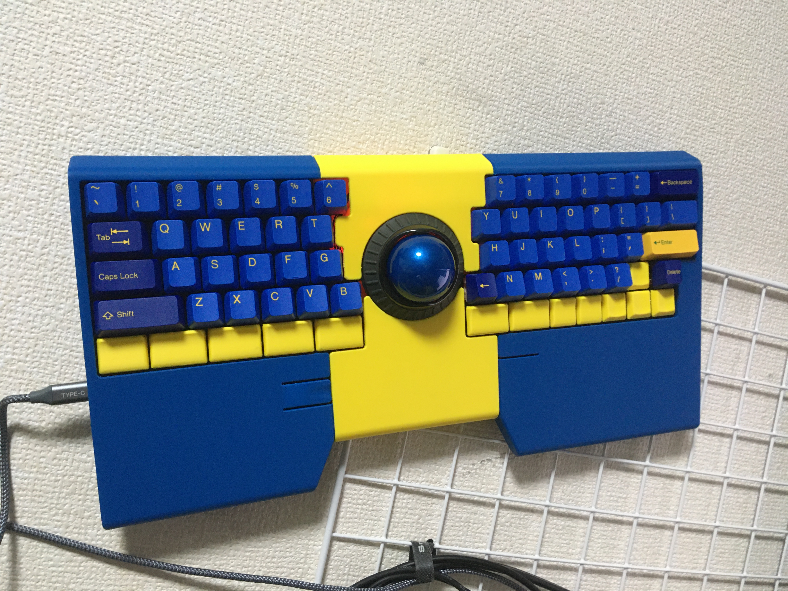

# skc03-ino-design

This repo consists of design files to build DIY keyboard [ino (Japanese)](https://github.com/hidsh/zzz-kbd/blob/master/products/ino/index.md).

## 3D Print
Folder [3dp](./3dp) contains some `step` files for enclosure case and choc-keycaps.

## PCB
Folder [pcb](./pcb) contains schematic and some gerber files.

## BOM
BOM(parts list) is available on [Google Spreadsheet](https://docs.google.com/spreadsheets/d/e/2PACX-1vQE1RzLHw71graJ5WT3xLqOeitd7p3jCuBzTkQNxFv0gUhjLC2Krv7XqfOAtS7fEDlFZxTjUkTnRmUb/pubhtml).

## links
- [firmware](https://github.com/hidsh/qmk_firmware/)
